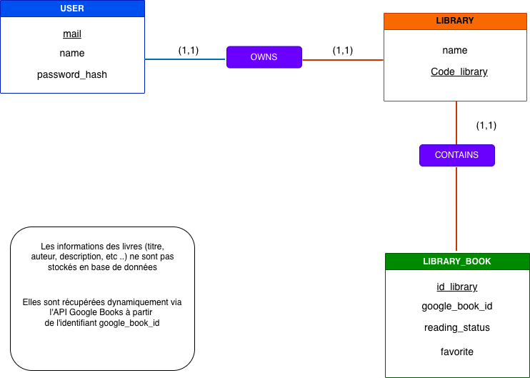
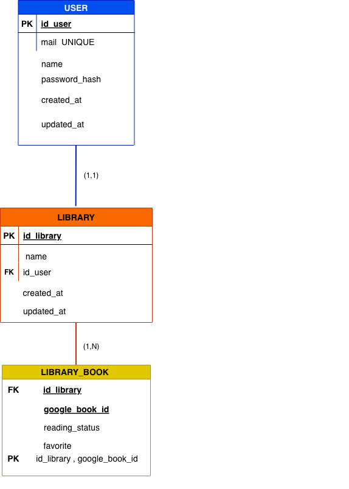

# Cahier des charges

## Présentation du projet

Le projet consiste à concevoir et développer une application web dédiée à la gestion
d’une bibliothèque personnelle.

L’objectif est de proposer une plateforme simple et intuitive permettant aux
utilisateurs de centraliser leurs livres, suivre l’avancement de leurs lectures et
découvrir de nouveaux ouvrages.

La page d’accueil met notamment en avant différentes catégories comme les genres,
les auteurs ou encore les coups de cœur des lecteurs, afin de faciliter l’exploration.

L’application est pensée pour répondre à plusieurs enjeux :

	• offrir une expérience utilisateur claire et facile à prendre en main, même pour
	un public non technique
	• garantir une accessibilité optimale, y compris pour les personnes ayant des
	besoins spécifiques
	• permettre une utilisation sans compte (mode visiteur) tout en proposant des
	fonctionnalités avancées pour les utilisateurs connectés

Ainsi :
	• un visiteur peut consulter librement le contenu et découvrir des livres
	• un utilisateur connecté peut gérer sa propre bibliothèque (ajout, suivi,
	organisation)

Le projet s’inscrit dans une démarche de développement en MVP (Minimum Viable
Product).

Cela signifie que cette première version se concentre sur les fonctionnalités
essentielles, afin de proposer un produit fonctionnel, cohérent et exploitable, tout en
laissant la place à des évolutions futures.

## Définition des besoins

Le projet répond à plusieurs besoins liés à la gestion et à la découverte de livres.

### Centraliser ses livres

Les utilisateurs ont besoin d’un espace unique pour regrouper et organiser leurs
livres, afin d’éviter la dispersion des informations.

### Suivre ses lectures

Les utilisateurs souhaitent pouvoir suivre l’avancement de leurs lectures et garder
une trace de leur progression.

### Découvrir facilement de nouveaux livres

Les utilisateurs ont besoin de moyens simples pour explorer de nouveaux contenus
(navigation, recherche, recommandations).

### Accéder librement au contenu

Un utilisateur doit pouvoir découvrir l’application sans obligation de création de
compte.

### Disposer d’un espace personnel sécurisé

Les utilisateurs doivent pouvoir accéder à un espace personnel pour gérer leurs
données de manière sécurisée.

### Utiliser une application accessible

L’application doit être utilisable par tous, y compris les personnes ayant des besoins
spécifiques en termes de lisibilité.

## Objectifs du projet

Le projet vise à proposer une application web fonctionnelle répondant aux besoins
identifiés, à travers les objectifs suivants :

## Permettre la gestion d’une bibliothèque personnelle

Mettre à disposition un espace utilisateur permettant d’ajouter, supprimer et
consulter des livres.

### Mettre en place un suivi de lecture

Permettre de définir et modifier le statut de lecture pour chaque livre.

### Proposer des outils de découverte

Offrir une navigation par genres et auteurs, ainsi qu’un moteur de recherche
performant.
### Permettre une utilisation sans compte

Donner accès aux fonctionnalités de découverte sans authentification.

### Implémenter un système d’authentification

Permettre la création de compte et la connexion sécurisée des utilisateurs.

### Intégrer un système de recommandation simple

Permettre aux utilisateurs de marquer des livres comme coups de cœur.

### Faciliter l’ajout de livres via une API externe

Intégrer une API (Google Books) pour enrichir facilement la base de données.

### Intégrer un mode accessibilité

Proposer une interface adaptée pour améliorer l’expérience utilisateur.

## Spécifications fonctionnelles

## MVP – Minimum Viable Product

Le MVP correspond à la première version fonctionnelle de l’application.
Il regroupe uniquement les fonctionnalités essentielles permettant à un utilisateur
de découvrir des livres et gérer une bibliothèque personnelle, tout en garantissant
une utilisation simple et cohérente.

### Fonctionnalités accessibles aux visiteurs

Les visiteurs peuvent utiliser l’application sans créer de compte, dans une logique de
découverte.

### Accès à la page d’accueil

La page d’accueil permet de découvrir l’application à travers plusieurs sections :

	• genres littéraires
	• auteurs
	• coups de cœur des lecteurs
	• sélection de livres

### Navigation par genres et auteurs

Les visiteurs peuvent explorer les livres selon :

	• les genres
	• les auteurs

### Consultation des fiches livres

Accès aux informations principales :

	• titre
	• auteur
	• résumé
	• genre

### Recherche de contenu

Un moteur de recherche permet de trouver rapidement :

	• un livre
	• un auteur
	• un genre

### Mode accessibilité

Activation d’un mode améliorant la lisibilité et le confort de navigation.

### Inscription et connexion

Possibilité de créer un compte et de se connecter pour accéder aux fonctionnalités
avancées.

### Fonctionnalités accessibles aux utilisateurs connectés

Les utilisateurs connectés disposent d’un espace personnel pour gérer leur
bibliothèque.

### Gestion de la bibliothèque

	• consultation des livres ajoutés
	• organisation de sa bibliothèque

### Ajouter / supprimer des livres

Ajout et suppression de livres dans sa bibliothèque personnelle.

### Suivi de lecture

Définition d’un statut pour chaque livre :

	• à lire
	• en cours
	• lu

### Gestion des coups de cœur

Possibilité de marquer des livres comme favoris afin de contribuer aux
recommandations.

### Recherche via API externe

Recherche de livres via une API externe (Google Books) pour faciliter l’ajout de
nouveaux ouvrages.

### Mode accessibilité

Disponible également pour les utilisateurs connectés.

## Évolutions potentielles du projet

Les fonctionnalités suivantes ne font pas partie du MVP.
Elles représentent des pistes d’amélioration permettant d’enrichir l’application à
moyen et long terme, en améliorant l’expérience utilisateur et en ajoutant des
dimensions sociales et analytiques.

### Fonctionnalités sociales

#### Partage de bibliothèque

Permettre aux utilisateurs de rendre leur bibliothèque publique ou accessible à
d’autres utilisateurs.
Cette fonctionnalité favoriserait l’échange et la découverte de nouvelles lectures.

#### Avis et notes sur les livres

Donner la possibilité aux utilisateurs de laisser un avis et d’attribuer une note à un
livre.
Cela permettrait d’enrichir les contenus et d’aider les autres utilisateurs dans leurs
choix.

#### Partage sur les réseaux sociaux

Permettre le partage de livres ou de coups de cœur sur des plateformes externes, afin
d’augmenter la visibilité de l’application.

#### Personnalisation de l’expérience

##### Recommandations personnalisées

Proposer des suggestions de livres basées sur :

	• les genres consultés
	• les livres ajoutés
	• les coups de cœur

#### Notifications

Mettre en place un système de notifications pour :

	• relancer une lecture en cours
	• suggérer de nouveaux livres
	• informer des nouveautés

#### Suivi et analyse

##### Statistiques de lecture

Fournir des indicateurs personnalisés, tels que :

	• nombre de livres lus
	• livres en cours
	• genres les plus consultés

#### Évolution technique

##### Application mobile

Développer une version mobile (ou progressive web app) afin d’améliorer
l’accessibilité et l’usage au quotidien.

#### Accessibilité avancée

Améliorer le mode accessibilité avec :

	• des options de personnalisation (taille, contraste, etc.)
	• une compatibilité avec les lecteurs d’écran
	• des réglages adaptés aux différents besoins utilisateurs

## Spécifications techniques

### Choix technologiques et justifications

Les technologies retenues ont été choisies afin de garantir une application
fonctionnelle, maintenable et évolutive, tout en restant adaptées au périmètre
du MVP.

#### Frontend

##### HTML5

HTML5 est utilisé pour structurer les pages de l’application.

Justification :

Il permet de créer une structure claire et sémantique, essentielle pour :

	• l’accessibilité
	• le référencement naturel (SEO)
	• la compatibilité avec les navigateurs modernes

##### CSS

CSS est utilisé pour la mise en forme de l’interface.

Justification :

Il permet de gérer l’apparence visuelle et d’assurer une interface claire et agréable :

	• mise en page
	• gestion des couleurs et typographies
	• adaptation aux différents écrans (responsive design)

##### JavaScript

JavaScript permet de gérer les interactions dynamiques côté client.

Justification :

Il est utilisé pour :

	• la gestion des actions utilisateur
	• l’affichage dynamique des données
	• la communication avec le backend via des requêtes HTTP
	• l’intégration d’API externes

#### Backend

##### Node.js

Node.js est utilisé comme environnement d’exécution côté serveur.

Justification :

Il permet de développer une application performante et cohérente avec
l’utilisation de JavaScript sur l’ensemble du projet (full JavaScript).

##### Express.js

Express.js est utilisé comme framework backend.

Justification :

Il facilite la mise en place :

	• des routes
	• des requêtes HTTP
	• des middlewares

et permet de structurer une API REST claire et maintenable.

#### Gestion des données

##### PostgreSQL

PostgreSQL est utilisé comme base de données relationnelle.

Justification :

Elle offre :

	• robustesse et fiabilité
	• gestion efficace des relations
	• respect des standards SQL

##### Sequelize (ORM)

Sequelize est utilisé pour interagir avec la base de données.

Justification :

Il permet de manipuler les données via des modèles, ce qui :

	• simplifie les requêtes
	• améliore la lisibilité du code
	• limite les erreurs

#### API externe

##### Google Books API

Cette API est utilisée pour récupérer des informations sur les livres.

Justification :

Elle permet de rechercher des livres (titre, auteur, ISBN) et de récupérer
automatiquement :

	• titre
	• auteur
	• description
	• couverture
	• date de publication

Cela évite la saisie manuelle et améliore la qualité des données.

#### Sécurité

##### Authentification

Un système d’authentification a été mis en place afin de sécuriser l’accès aux fonctionnalités de l’application.
Concrètement, certaines routes sont protégées par un middleware d’authentification, ce qui permet de vérifier qu’un utilisateur est bien connecté avant d’accéder à ses données personnelles, comme sa bibliothèque.
Cela permet de garantir que chaque utilisateur ne peut accéder qu’à ses propres informations.

##### Protection des données

Les mots de passe des utilisateurs ne sont jamais stockés en clair dans la base de données.Ils sont hashés avant d’être enregistrés, ce qui permet de sécuriser les informations sensibles en cas de fuite de données.
Les échanges entre le frontend et le backend se font via des requêtes HTTP structurées, ce qui permet de contrôler les données envoyées et reçues.

##### Bonnes pratiques mises en place

Plusieurs bonnes pratiques ont été appliquées tout au long du développement :

	- validation des données côté serveur, pour éviter les entrées invalides ou malveillantes
	- protection des routes sensibles, accessibles uniquement aux utilisateurs authentifiés
	- utilisation de Sequelize, qui limite les risques d’injection SQL grâce aux requêtes paramétrées
	attention portée à l’affichage des données pour limiter les risques de failles XSS

L’objectif est d’assurer un niveau de sécurité cohérent avec le périmètre du projet.

#### Expérience utilisateur

##### Responsive design (Mobile First)

L’application est conçue en mobile first.

Justification :

Garantit une expérience optimale sur :

	• mobile
	• tablette
	• ordinateur

#### Accessibilité

Un mode accessibilité est intégré.

Justification :

Permet d’améliorer la lisibilité (ex : augmentation de la taille du texte) et
constitue une première approche vers une interface inclusive.

#### Référencement (SEO)

Des bonnes pratiques SEO sont appliquées.

Justification :

	• structure HTML sémantique
	• URLs lisibles

Objectif : améliorer la visibilité sur les moteurs de recherche.

#### Éco-conception

Des principes d’optimisation sont pris en compte.

Justification :

	• limitation des requêtes inutiles
	• optimisation des ressources

Objectif : réduire l’impact environnemental.

#### Déploiement

##### Docker

Docker est utilisé pour le déploiement.

Justification :

Permet de garantir un environnement identique entre développement et production :

	• déploiement simplifié
	• meilleure portabilité
	• maintenance facilitée

## Cible du projet

### Public visé

L’application s’adresse à un public large souhaitant gérer, suivre et découvrir des
livres de manière simple et accessible, sans nécessiter de compétences techniques
particulières.

### Profils principaux d’utilisateurs

#### Lecteurs occasionnels

Les lecteurs occasionnels souhaitent garder une trace de leurs lectures sans utiliser
des outils complexes.

L’application leur permet de :

	• suivre leurs lectures
	• organiser simplement leurs livres
	• retrouver facilement leurs informations

#### Lecteurs réguliers

Les lecteurs plus assidus ont besoin d’un outil structuré pour gérer un volume plus
important de livres.

L’application leur permet de :

	• organiser leur bibliothèque
	• suivre leur progression
	• découvrir de nouveaux livres

#### Utilisateurs en phase de découverte

Certains utilisateurs souhaitent explorer l’application avant de s’engager.

Ils peuvent :

	• consulter les livres
	• naviguer par genres et auteurs
	• tester les fonctionnalités principales

Cette approche facilite l’adoption en réduisant les freins à l’inscription.

#### Accessibilité et inclusion

L’application est conçue pour être utilisable par le plus grand nombre, y compris les
personnes ayant des difficultés de lecture ou de navigation.

Un mode accessibilité permet :

	• d’améliorer la lisibilité
	• d’augmenter le confort d’utilisation

#### Contexte d’utilisation

L’application est accessible :

	• depuis un navigateur web
	• sur ordinateur, tablette et smartphone

Elle s’adresse à un public non technique, avec une interface pensée pour être intuitive
et rapide à prendre en main.

## Compatibilité des navigateurs

L’application est conçue pour être accessible sur les navigateurs web les plus utilisés,
afin de garantir une expérience utilisateur fiable, cohérente et accessible au plus
grand nombre.

### Navigateurs desktop supportés

L’application est compatible avec les navigateurs modernes suivants :

	• Google Chrome
	• Mozilla Firefox
	• Microsoft Edge
	• Safari

### Navigateurs mobiles
L’application est également accessible sur les principaux navigateurs mobiles :

	• Chrome Mobile (Android)
	• Safari Mobile (iOS)

### Choix techniques favorisant la compatibilité

L’utilisation de technologies web standards permet d’assurer une bonne
compatibilité :

	• HTML5 pour une structure sémantique
	• CSS pour la mise en forme et le responsive design
	• JavaScript (ES6+) pour les interactions dynamiques

Ces technologies sont largement supportées par les navigateurs modernes.

### Responsive design

L’application est développée selon une approche mobile first, garantissant une
adaptation fluide à différents formats d’écran :

	• smartphone
	• tablette
	• ordinateur

### Tests et limites

Des tests ont été réalisés sur les principaux navigateurs afin de vérifier le bon
fonctionnement de l’application.

L’application est optimisée pour les versions récentes des navigateurs.
La compatibilité avec des navigateurs obsolètes (ex : Internet Explorer) n’est pas
garantie.

## Arborescence de l’application

### Organisation des routes

L’application Lectio est structurée autour de différentes routes permettant d’accéder
aux fonctionnalités principales.

Ces routes sont organisées selon le type d’utilisateur : visiteur ou utilisateur
connecté.

#### Routes accessibles aux visiteurs

Les visiteurs peuvent naviguer librement dans l’application et consulter les contenus
en lecture seule.

	• / → Page d’accueil
	• /home → Page d’accueil dynamique
	• /login → Connexion
	• /register → Inscription
	• /genres → Liste des genres
	• /genres/:slug → Livres d’un genre
	• /authors/:name → Livres d’un auteur
	• /books/:id → Détail d’un livre
	• /mentions-legales → Mentions légales
	• /accessibilite → Mode accessibilité

Ces routes permettent une exploration complète de l’application sans
authentification.

#### Routes accessibles aux utilisateurs connectés

Les utilisateurs connectés disposent de fonctionnalités supplémentaires liées à leur
espace personnel.

	• /library → Bibliothèque personnelle

#### Actions disponibles :

	• POST /library/add → Ajouter un livre
	• POST /library/remove → Supprimer un livre
	• POST /library/favorite → Ajouter / retirer un favori

Ces routes permettent la gestion des livres et des préférences utilisateur.
Logique de navigation

Le parcours utilisateur est pensé pour être simple et fluide :

	1. L’utilisateur arrive sur la page d’accueil
	2. Il explore les contenus (genres, auteurs, suggestions)
	3. Il consulte le détail d’un livre
	4. Il peut ensuite :
		◦ créer un compte / se connecter
		◦ ajouter le livre à sa bibliothèque (si connecté)

#### Choix de conception (MVP)

Contrairement à une structure classique, l’application ne propose pas de page
catalogue globale des livres (/books).

Les livres sont accessibles via différents points d’entrée :

	• page d’accueil
	• genres
	• auteurs

Ce choix permet :

	• de simplifier la navigation
	• de limiter la complexité technique
	• de rester cohérent avec le périmètre du MVP

#### Objectif de cette arborescence

Cette organisation vise à :

	• faciliter la navigation
	• réduire le nombre d’étapes pour accéder à un contenu
	• proposer une expérience intuitive, même pour un utilisateur non connecté

## Schéma d’arborescence

Ce schéma représente l’arborescence des routes frontend de l’application et illustre les principaux parcours utilisateurs.

.png)

## Tableau des Endpoints API et descriptions

### Google Books (API EXTERNE)

| Verbe HTTP | URL    | Router       | Controller & Méthode    | Modèle & Méthodes | Description                                   |
|------------|----------------|--------------|-----------------------------|-------------------|-----------------------------------------------|
| GET       | /api/google-books/search | googleBooksRouter  | googleBooksController.search     |        | Rechercher des livres via Google Books                |
| GET       | /api/books/google/:googleId   | bookRouter   | bookController.getGoogleBook      |     | Voir le détail d'un livre depuis Google Books                   |

### Authentification

| Verbe HTTP | URL    | Router       | Controller & Méthode    | Modèle & Méthodes | Description                                   |
|------------|----------------|--------------|-----------------------------|-------------------|-----------------------------------------------|
| POST       | /auth/register | authRouter  | authController.register     | User.create       | Créer un compte utilisateur                   |
| POST       | /auth/login    | authRouter  | authController.login        | User.findOne     | Connecter un utilisateur                     |
| GET       | /auth/logout   | authRouter  | authController.logout       |     | Déconnecter un utilisateur                     |

### Utilisateur

| Verbe HTTP | URL        | Router       | Controller & Méthode           | Modèle & Méthodes | Description                               |
|-----------|------------|--------------|---------------------------------|-------------------|-------------------------------------------|
| GET       | /library | libraryRouter  | libraryController.getMyLibrary  | Library.findOne   | Récupérer la bibliothèque utilisateur     |
| POST       | /api/library/books  | libraryRouter  | libraryController.addBookToLibrary   | LibraryBook.create     | Ajouter un livre à la bibliothèque       |
| PATCH     | /api/library/books/:google_book_id  | libraryRouter   | libraryController.updateReadingStatus       | LibraryBook.update   | Modifier le statut de lecture |
| DELETE      | /api/library/books/:google_book_id  | libraryRouter   | libraryController.deleteBookFromLibrary      | Library.destroy    | Supprimer un livre de la bibliothèque                 |
| PATCH     | /api/library/name    | libraryRouter   | libraryController.updateLibraryName    | LibraryBook.update       | Modifier le nom de la bibliothèque   |

### Routes Pages (Render)

| Verbe HTTP | URL          | Router       | Modèle & Méthodes | Description                         |
|-----------|--------------|---------------|-----------------------------|---------------------------|
| GET        | /           | pageRouter    |                   | Page d'Acceuil                      |
| GET        | /home       | pageRouter    |                   | Page principale                     |
| GET        | /library    | pageRouter    | Library.findOne   | Afficher la bibliothèque utilisateur|
| POST       | /library/add| pageRouter    | LibraryBook.create| Ajouter un livre via un formulaire  |
| POST       | /library/remove   | pageRouter    | LibraryBook.destroy| Supprimer un livre.          |
| POST       | /library/favorite | pageRouter    | LibraryBook.update | Ajouter un favori            |
| GET        | /genres           | pageRouter    |                   | Liste des genres              |
| GET        | /genres/:slug     | pageRouter    |                   | Livres par genres             |
| GET        | /authors/:name    | pageRouter    |                   | Livres par auteurs            |
| GET        | /books/:id        | pageRouter    |                   | Détail d'un livre             |
| GET        | /mentions-legales | pageRouter    |                   | Page Mentions légales         |
| GET        | /accessibilite    | pageRouter    |                   | Page Accessibilité            |

### 🚨 Tableau des codes d’erreur HTTP

| Code | Signification          | Cas typique                                 |
|------|------------------------|---------------------------------------------|
| 200  | OK                     | Requête réussie (GET, PUT, PATCH)           |
| 201  | Created                | Ressource créée avec succès (POST)          |
| 204  | No Content             | Suppression réussie (DELETE)                |
| 400  | Bad Request            | Données manquantes ou invalides              |
| 401  | Unauthorized           | Authentification requise ou invalide         |
| 403  | Forbidden              | Accès refusé malgré l’authentification       |
| 404  | Not Found              | Ressource introuvable                        |
| 409  | Conflict               | Conflit lors de la création ou modification  |
| 500  | Internal Server Error  | Erreur interne du serveur                    |

## User Stories

### Visiteur (non connecté)

| En tant que | Je veux                                | Afin de                                               |
|-------------|----------------------------------------|------------------------------------------------------|
| Visiteur    | Accéder à la page principale           | Découvrir l’application                              |
| Visiteur    | Consulter les livres proposés          | Explorer les livres disponibles                      |
| Visiteur    | Naviguer par genres                    | Découvrir des livres selon mes préférences           |
| Visiteur    | Consulter la page d’un auteur          | Voir les livres associés                             |
| Visiteur    | Consulter le détail d’un livre         | Lire son résumé et ses informations                  |
| Visiteur    | Utiliser le moteur de recherche        | Trouver un livre, un auteur via l'Api Google Books   |
| Visiteur    | Accéder aux pages d'informations       | Comprendre le cadre et l'usage de l'application      |
| Visiteur    | Créer un compte ou me connecter        | D'accéder à ma bibliothèque                          |

### Utilisateur connecté

| En tant que            | Je veux                                      | Afin de                                           |
|------------------------|-----------------------------------------------|---------------------------------------------------|
| Utilisateur connecté   | Accéder à ma bibliothèque                    | Voir tous les livres que j’ai ajoutés             |
| Utilisateur connecté   | Ajouter un livre à ma bibliothèque           | Gérer ma collection                               |
| Utilisateur connecté   | Retirer un livre de ma bibliothèque          | Maintenir ma collection à jour                    |
| Utilisateur connecté   | Modifier le statut de lecture d'un livre     | Suivre l’avancement de mes lectures               |
| Utilisateur connecté   | Marquer un livre comme favori                | Retrouver facilement mes coups de coeur |
| Utilisateur connecté   | Modifier le nom de la bibliothèque           | Personnaliser ma bibliothèque           |

### API externe (Google Books)

| En tant que | Je veux                                      | Afin de                                      |
|-------------|-----------------------------------------------|----------------------------------------------|
| Utilisateur | Rechercher un livre ou un auteur via une API Google Books | Récupérer automatiquement les informations d'un livre ou d'un auteur |
| Utilisateur | Consulter les détails d'un livre externe    | Visualiser les informations sans stockage en base  |

### Évolutions futures 

| En tant que | Je veux                                   | Afin de                                   |
|-------------|--------------------------------------------|------------------------------------------|
| Utilisateur connecté | Laisser un avis sur un livre     | Partager mon opinion                      |
| Utilisateur connecté | Noter un livre                   | Évaluer mes lectures                      |
| Utilisateur connecté | Recevoir des recommandations     | Découvrir de nouveaux livres              |
| Utilisateur connecté | Partager ma bibliothèque         | Permettre à d’autres d’y accéder          |
| Utilisateur connecté | Supprimer ma bibliothèque        | Réinitialiser ma collection et repartir de zéro |
| Utilisateur connecté | Accéder à ma page profile        | Consulter mes informations personnelles   |
| Utilisateur connecté | Modifier mes informations        | Personnaliser mon compte                  |
| Utilisateur connecté | Supprimer mon compte             | Gérer mes données personnelles            |
| Utilisateur connecté | Personnaliser ma bibliothèque    | Adapter l'interface à mes préférences     |
| Utilisateur connecté | Organiser mes livres             | Mieux structurer ma collection            |
| Utilisateur connecté | Ajouter une description à ma bibliothèque| Donner du contexte à ma collection|

## Charte Graphique

### LOGO

	- voir le logo : 
	

### Intention graphique

L’identité visuelle de l’application Lectio repose sur un univers à la fois calme,
moderne et accessible, en cohérence avec l’usage principal de l’application : la
lecture et la gestion personnelle de livres.

L’objectif est de proposer une interface :

	• apaisante, adaptée à une utilisation prolongée
	• structurée, facilitant l’organisation des informations
	• engageante, donnant envie de découvrir et suivre ses lectures

L’univers graphique s’appuie sur une combinaison de couleurs froides et d’un accent
chaud, permettant de créer un équilibre entre lisibilité et dynamisme.

### Palette de couleurs

#### Couleurs principales

• Bleu principal : #1E3A8A

Utilisé pour la navigation, les titres et les éléments structurants → inspire confiance et concentration

• Bleu secondaire / turquoise : #2CB1BC

Utilisé pour les éléments interactifs (liens, icônes, badges) → apporte modernité et clarté

• Couleur d’accent (orange) : #F97316

Utilisée pour les actions principales (CTA, favoris, interactions) → attire l’attention et dynamise l’interface

#### Couleurs neutres

	• Fond principal : #F8FAFC (clair, adapté à la lecture)
	• Texte principal : #0F172A (lisible et moins agressif que noir pur)
	• Texte secondaire : #64748B
	• Bordures / séparateurs : #E2E8F0

#### Accessibilité

Un mode accessibilité est proposé afin d’améliorer la lisibilité.

	• Fond : #FFFFFF
	• Texte : #000000
	• Accent renforcé : #EA580C
	• Focus visible sur les éléments interactifs (boutons, champs)

Cette approche permet de rendre l’application utilisable par un plus large public.

#### Codes couleur des statuts

Les statuts de lecture sont différenciés visuellement afin de faciliter la
compréhension rapide :

	• À lire → #38BDF8
	• En cours → #FACC15
	• Lu → #22C55E

Chaque statut est accompagné :

	• d’une couleur
	• d’un label texte pour garantir l’accessibilité

#### Typographies

• Inter (sans-serif)

Utilisée pour l’interface (titres, boutons, navigation) → lisibilité optimale et rendu moderne

• Literata (serif)

Utilisée pour le contenu textuel (résumés, descriptions) → améliore le confort de lecture

#### Composants UI

##### Bouton principal (CTA)

	• Fond : orange (#F97316)
	• Texte : blanc
	• Forme : arrondie (rounded-xl)
	• Effet hover : couleur plus foncée

utilisé pour les actions importantes (ex : ajouter un livre)

##### Bouton secondaire

	• Fond transparent
	• Bordure bleue (#1E3A8A)
	• Hover léger

##### Bouton tertiaire

	• Texte discret
	• Utilisé pour les actions secondaires

##### Style visuel

	• Icônes simples (outline)
	• Utilisation d’angles arrondis
	• Cartes avec ombres légères
	• Espaces suffisants pour une bonne lisibilité

L’interface est pensée pour être claire, aérée et facile à parcourir.

#### Cohérence avec le projet

Cette charte graphique a été conçue en cohérence avec :

	• les besoins d’accessibilité
	• le type d’utilisateur (grand public)
	• le contexte d’utilisation (lecture prolongée)
	
Elle permet de garantir une expérience utilisateur fluide et homogène sur l’ensemble
de l’application.

## Gestion de projet

Le projet Lectio a été réalisé en autonomie, dans le cadre de la formation
Développeur Web et Web Mobile.

J’ai assuré l’ensemble des rôles liés au projet, notamment :

	- la conception fonctionnelle et technique
	- le développement frontend et backend
	- la gestion de la base de données
	- les tests et le déploiement

Cette organisation m’a permis de développer une vision globale d’un projet web, en
gérant à la fois les aspects techniques, fonctionnels et organisationnels.

Les documents MCD, le MLD, les wireframes, les maquettes (dossier Design) sont à retrouvés dans les différents dossiers ou ici : 
	- pour voir le schéma du MCD : 
	
	

	- pour voir le schéma du MLD : 
	
	

Ces éléments permettent de détailler la structure de l’application, l’organisation des
données et la conception de l’interface utilisateur.

Certaines phases de réflexion (brainstorming) ont été réalisées en amont du projet
afin de définir les premières orientations.

